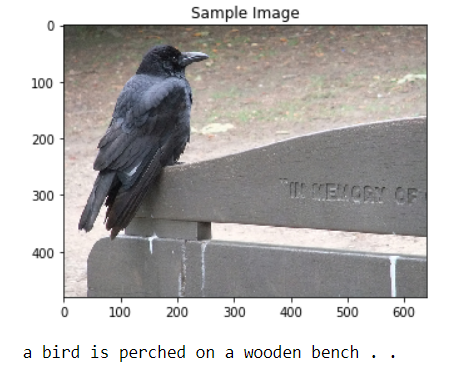
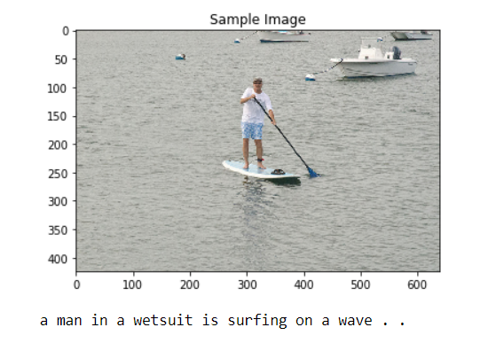
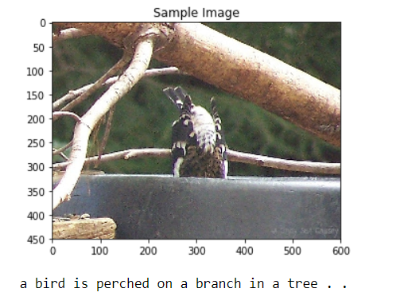
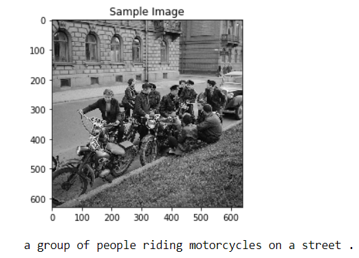
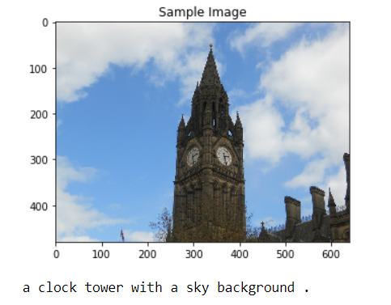

# Image-Captioning:
Generate a caption that describes the content of an image.
### Network:
* **Encoder**:
A pretrained resnet network is used to capture the image features. The final layer of the resnet network is replaced with a linear layer.

  | - | Layer    | I/O                             | Pretrained |
  |---|----------|---------------------------------|------------|
  | 1 | Resnet50 | (3,224,224)/(1,2048(flattened)) | 1          |
  | 2 | Linear   | (1,2048)/(1,256)                | 0          |

* **Decoder**:
LSTM together with linear layers are responsible for generating a sequence of words that describes the image.

| - | Layer     | I/O             | Pretrained |
|---|-----------|-----------------|------------|
| 1 | Embedding | (1)/(1,256)     | 0          |
| 2 | LSTM      | (1,256)/(1,512) | 0          |
| 3 | Linear    | (1,512)/(9955)  | 0          |

### Preprocessing:

* **Image Preprocessing**:
  * The images undergo some transformations such as resizing and normalization to match the specification of the input of the pretrained resnet network.
  * In the training phase, random flipping and cropping are added to the transformations to avoid over-fitting.
* **Caption Preprocessing**:
  * Captions need to be tokenized therefore, a vocab dictionary is created from the captions associated with the training images.
  * Each word is represented by a unique token.  

### Training:
* The model gets an image and then it starts to generate the next token in the sequence.
* Each generated word is compared to the ground truth caption to define the loss.
* The LSTM layer is fed with the ground truth word till it finishes the caption.

### Inference:
* The model predicts the next token in the sequence based on the previous tokens and the image features.
* Each predicted word is fed back to the LSTM layer till the end end of the caption.
* The model outputs the probability of each word in the dictionary to be selected as the best word to form the sequence. By taking the word that associated with the maximum probability ([Greedy Search](https://en.wikipedia.org/wiki/Greedy_algorithm)) that might not lead to the best possible caption.
* Two methods were adapted in this project:
  1. [Greedy Search](https://en.wikipedia.org/wiki/Greedy_algorithm).
      * In Greedy search, the word with the maximum probability is selected.
  2. [Beam Search](https://youtu.be/RLWuzLLSIgw).
      * In Beam search, using a b-sized window at each step to select best possible b words to form the sequence.
      * In order to get the best possible sequence, the sum of the logarithmic probability of each word in a sequence should be maximized.
      * Currently, the implementation of the beam search is working on cpu not gpu.

### Hyperparameters:
| - | Parameter        | Value |
|---|------------------|-------|
| 1 | Batch size       | 128   |
| 2 | Vocab threshold  | 4     |
| 3 | embedding size   | 256   |
| 4 | LSTM Hidden size | 512   |
| 5 | number of epochs | 20    |

### Results:
1.

2.

3.

4.

5.

#### Note:

This project is one of three projects accomplished in the Udacity computer vision Nanodegree program.
